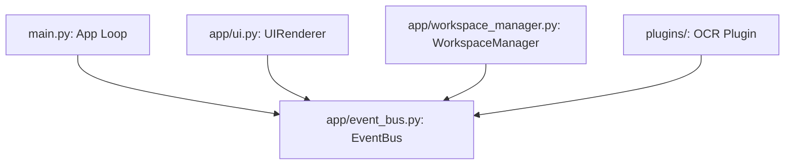
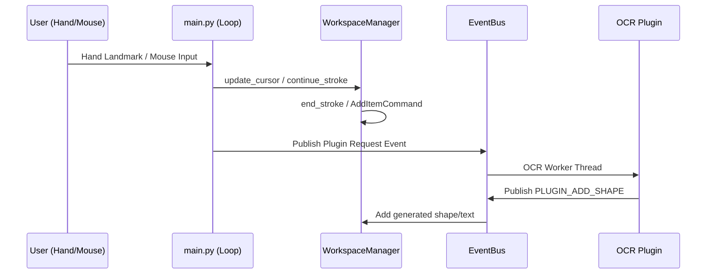
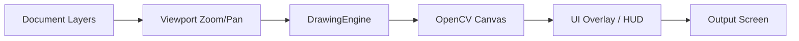

# Ekora System Architecture

This document provides an overview of Ekora's architectural design, component interactions, and execution pipelines.

---

## 1. System Overview

Ekora is built on an event-driven decoupled architecture. The core application logic does not directly call user interface elements, gesture detectors, or plugins. Instead, components communicate asynchronously using a central `EventBus`.



---

## 2. Central EventBus

The `EventBus` handles publish-subscribe routing. Events are defined in `EventType` and are dispatched using synchronous list callbacks.

### Core Event Flow:



---

## 3. Command Pattern (Undo/Redo Stack)

To ensure workspace reliability, all modifying actions are wrapped in commands implementing the `ICommand` protocol.

```python
class ICommand(Protocol):
    def execute(self, document: Document) -> None: ...
    def undo(self, document: Document) -> None: ...
```

### Supported Commands:
- **`AddItemCommand`**: Adds a single stroke or shape.
- **`RemoveItemCommand`**: Deletes a shape or stroke (fully undoable).
- **`ModifyShapeCommand`**: Tracks translation and resize parameters for shapes.
- **`ModifyStrokeCommand`**: Tracks translation and scale parameters for freehand strokes.
- **`ClearDocumentCommand`**: Stores active layers before clearing to allow full undo recovery.

---

## 4. Rendering Pipeline

The rendering pipeline is stateless and operates in screen coordinates.



1. **Document Layer Query**: Traverses active, visible vector strokes and shapes.
2. **Coordinate Transformation**: Viewport translates coordinates from document space to screen space:
   $$x_{\text{screen}} = (x_{\text{doc}} \times \text{zoom}) + \text{pan\_x}$$
3. **Stateless Drawing**: OpenCV renders freehand polylines, vector shapes, and anti-aliased text fonts onto a NumPy array canvas.
4. **Overlay**: HUD status, mouse hover indicators, and bounding boxes are rendered on top.

---

## 5. OCR Plugin Architecture

Plugins run computationally intensive background tasks off the main thread to keep drawing smooth at 60 FPS.

- **OCR Plugin**: Preprocesses canvas crops via adaptive image enhancement pipelines (`CLAHE`, `Otsu`, deskewing) and extracts text using Tesseract OCR.

