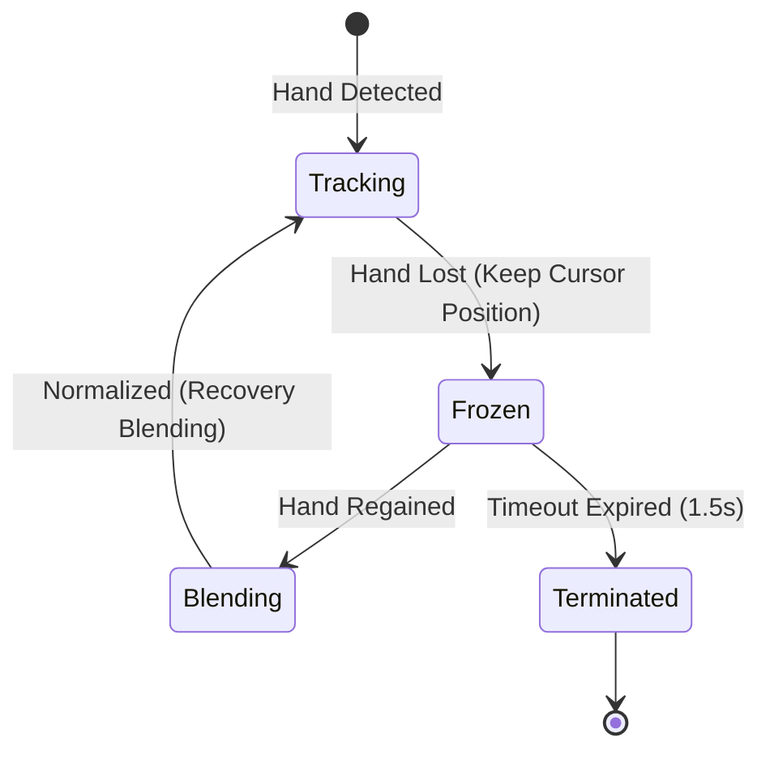

# Gesture & Tracking Pipeline

This document describes the hand tracking pipeline, landmark preprocessing, speed-adaptive filtering, recovery, and debouncing heuristics.

---

## 1. Input Processing: MediaPipe Landmarks

MediaPipe Hand Landmarker outputs 21 coordinates in 3D space:

```
                  8   12  16  20
                  |   |   |   |
              8--7   11  15  19
              |   |   |   |   |
          4   6   10  14  18
          |   |   |   |   |
      3---2   5---9---13--17
       \ /
        1
        |
        0 (Wrist)
```

Each frame, the raw coordinates are scaled to screen coordinates using the camera viewport dimensions, then normalized to $[0.0, 1.0]$ bounds to ensure rotation and distance scaling invariance.

---

## 2. Speed-Adaptive Dynamic Smoothing (One Euro Filter)

To balance responsiveness and jitter reduction, the pointer uses a speed-adaptive **One Euro Filter** to process coordinate positions.

- **Slow movements**: High smoothing is applied to eliminate hand tremors.
- **Fast movements**: Low smoothing is applied to reduce tracking latency.

### Mathematical Formulation:
For each coordinate $x$ at timestamp $t$ (with $\Delta t = t - t_{\text{prev}}$):

1. **Calculate Velocity**:
   $$v = \frac{x - x_{\text{prev}}}{\Delta t}$$
2. **Apply Velocity Smoothing**:
   $$v_{\text{smooth}} = \alpha_d \cdot v + (1 - \alpha_d) \cdot v_{\text{smooth\_prev}}$$
   where $\alpha_d = \frac{1}{1 + \frac{\tau_d}{\Delta t}}$ and $\tau_d = \frac{1}{2\pi \cdot f_{\text{d\_cutoff}}}$.
3. **Compute Adaptive Cutoff Frequency**:
   $$f_{\text{cutoff}} = f_{\text{min\_cutoff}} + \beta \cdot |v_{\text{smooth}}|$$
4. **Apply Final Coordinate Smoothing**:
   $$\alpha = \frac{1}{1 + \frac{\tau}{\Delta t}} \quad \text{with} \quad \tau = \frac{1}{2\pi \cdot f_{\text{cutoff}}}$$
   $$x_{\text{smooth}} = \alpha \cdot x + (1 - \alpha) \cdot x_{\text{smooth\_prev}}$$

### Default Parameters:
- `FILTER_MIN_CUTOFF`: $1.0\text{ Hz}$
- `FILTER_BETA`: $0.05$
- `FILTER_D_CUTOFF`: $1.0\text{ Hz}$

---

## 3. Smooth Tracking Recovery

If a hand is temporarily lost behind an obstacle, or leaves the camera frame:



1. **Hold Current Position**: Rather than snapping the cursor to $(0,0)$ or terminating the current stroke immediately, the cursor freezes at the last verified position.
2. **Grace Period**: The active stroke is held for up to `TRACKING_TIMEOUT` ($1.5$ seconds) before terminating.
3. **Smooth Return Blending**: When landmarks are recovered, instead of snapping the cursor to the new coordinate, the cursor coordinates are smoothly interpolated back to avoid coordinate leaps:
   $$\vec{P}_{\text{cursor}} = (1 - \alpha_{\text{recovery}}) \cdot \vec{P}_{\text{frozen}} + \alpha_{\text{recovery}} \cdot \vec{P}_{\text{new}}$$
   where $\alpha_{\text{recovery}} = 0.25$.

---

## 4. Hysteresis-Backed Pinch & Palm Detections

- **Pinch (Thumb + Index Tip)**:
  - Distance normalization uses wrist-to-middle-finger size:
    $$\text{Scale} = \frac{\text{dist}(\text{Wrist}, \text{Middle\_MCP}) + \text{dist}(\text{Index\_MCP}, \text{Pinky\_MCP})}{2}$$
  - Hysteresis limits prevent flickering near selection thresholds:
    - **Enter**: Triggered when normalized distance is $< 0.15$ for $\ge 2$ consecutive frames.
    - **Exit**: Released when normalized distance is $> 0.30$ for $\ge 3$ consecutive frames.
- **Open Palm (Clear)**:
  - Require $\ge 4$ extended fingers.
  - Active stroke is held for a stable hold of `PALM_HOLD_DURATION` ($150\text{ ms}$) before executing the clear canvas action.

---

## 5. Fist Gesture (Pause & Disjoint Stroke Synchronization)

During continuous drawing using the `POINT` gesture, the user can temporarily pause the current stroke by forming a `FIST` gesture.

### Synchronization Logic:
- **Visual Cursor Movement**: The visual pointer continues tracking the hand position during the pause.
- **Stroke Freezing**: The active stroke is frozen; no new coordinates are appended, and the drawing engine stops rendering new lines.
- **Segment Delimitation**: When transitioning back from `FIST` (Pause) to `POINT` (Draw), a `None` coordinate delimiter is appended to the stroke point coordinates sequence.
- **Rendering & Operations Handling**:
  - The interpolation pipeline splits coordinates by `None` bounds and runs independent Catmull-Rom spline interpolation on each subset.
  - `DrawingEngine` renders these segments disjointly via a single `cv2.polylines` call.
  - Undo/redo actions and SVG serialization treat the disjoint segments as a single unified transaction.
  - This avoids introducing long "jump lines" between pre-pause and post-pause fingertips.
